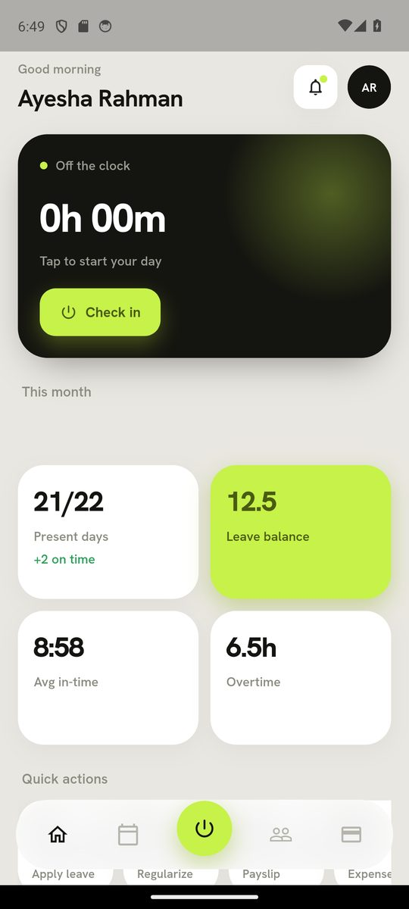
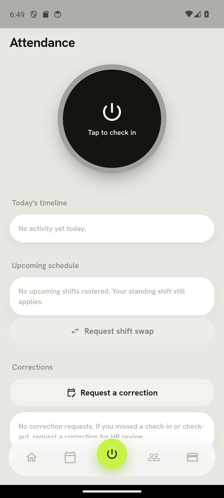
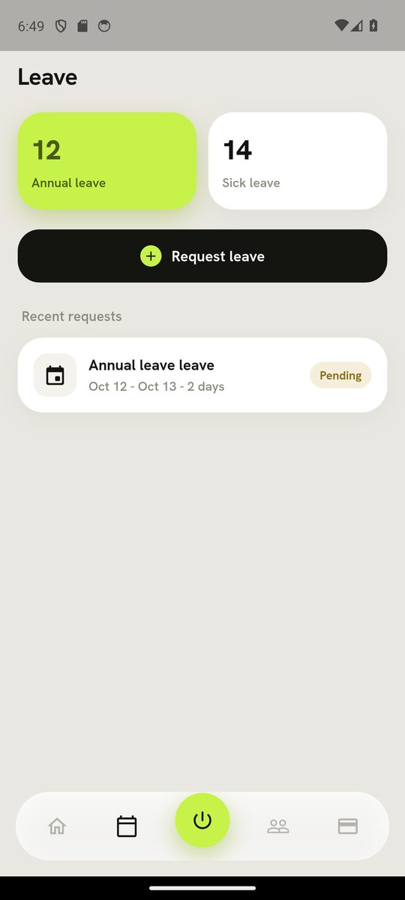
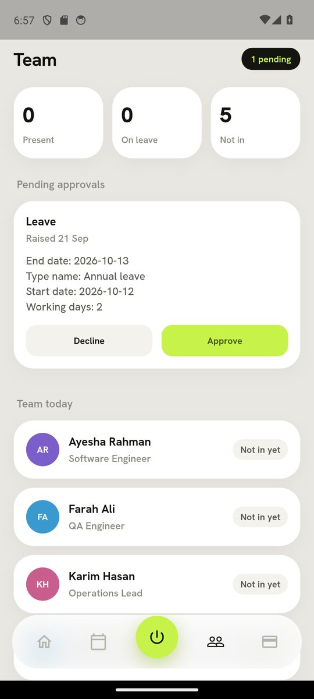
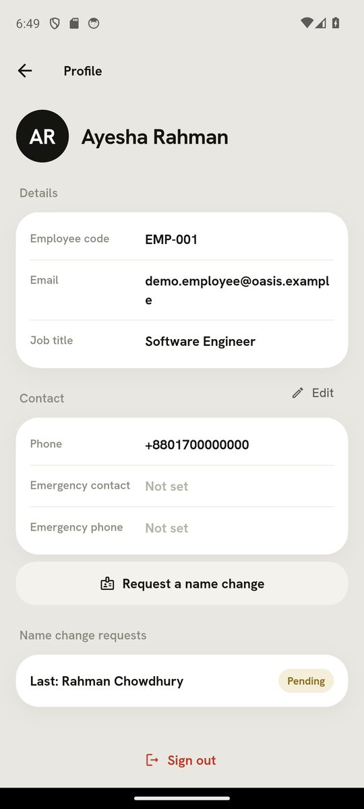
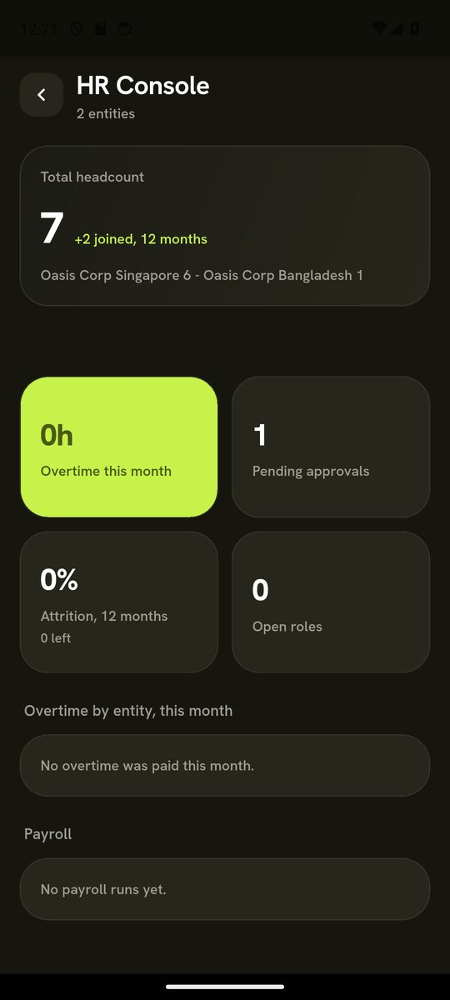
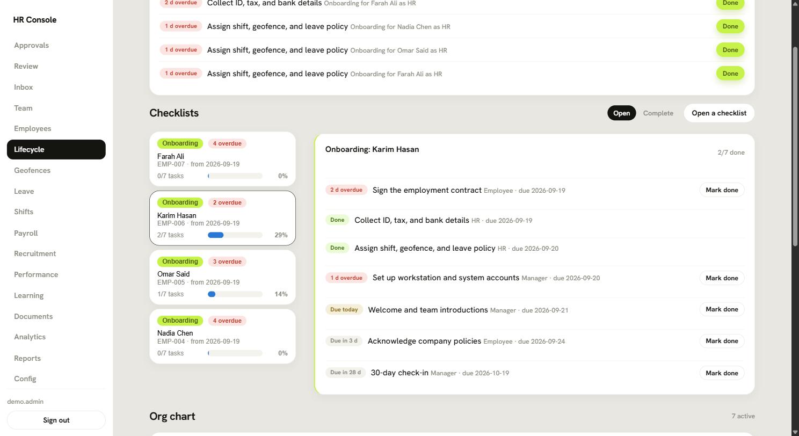
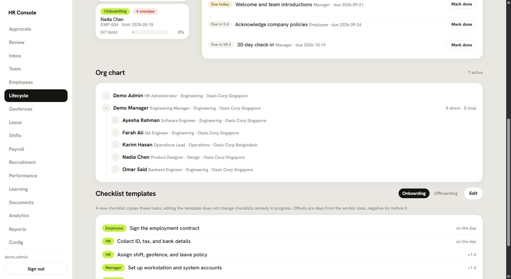
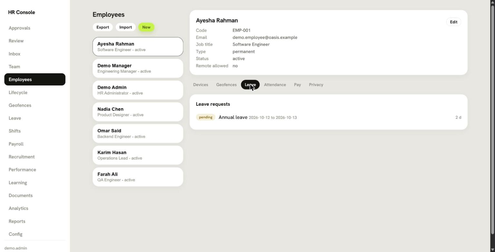
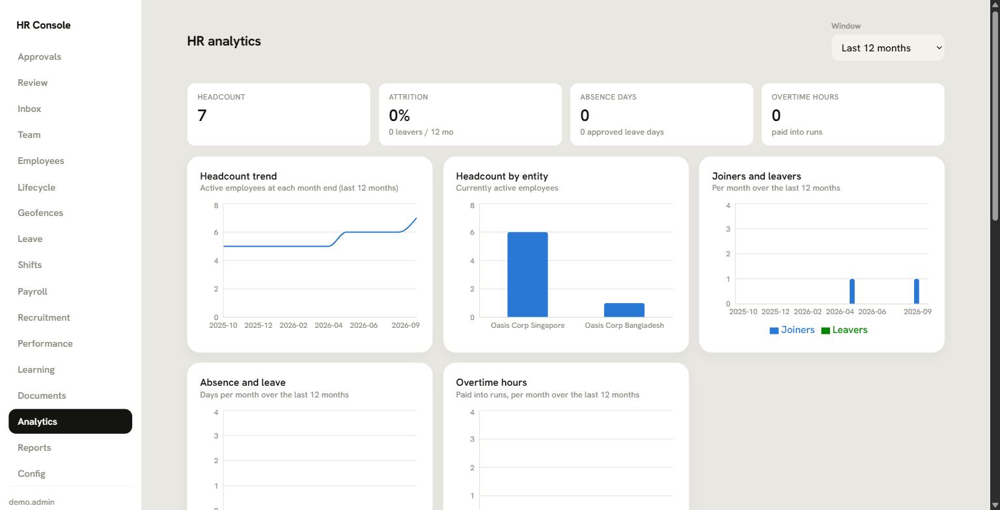

# HRIS Platform

Multi-tenant HRIS platform with mobile attendance and verification. The seed data
describes a fictional "Oasis Corp" tenant with Singapore and Bangladesh entities.

Stack: Flutter (mobile), React + TypeScript (web, added later), Node/TypeScript NestJS (backend), PostgreSQL.

## Screenshots

### Employee app (Flutter)

Captured on a Pixel 7 emulator. Home, Attendance, Leave, and Profile are the
employee's own view; Team is the manager's view with a leave request waiting
for approval; HR Console is the administrator's org-wide summary.

<p>
  
  
  
  
  
  
</p>

### HR console (React)

Signed in as the demo HR administrator.

| Onboarding checklists | Org chart |
| --- | --- |
|  |  |

| Employees | Analytics |
| --- | --- |
|  |  |

## Monorepo layout

- `backend/` NestJS API, workflow engine, scoring, jobs.
- `packages/` shared TypeScript packages (added later).
- `web/` React console (added later).
- `mobile/` Flutter employee app (added later).
- `infra/` Docker Compose and infrastructure config.

## Local development

Prerequisites: Node 20+ (24 tested), pnpm 11+, Docker Desktop (for Postgres).

```bash
# 1. Install workspace dependencies
pnpm install

# 2. Start Postgres (requires Docker Desktop running)
pnpm db:up

# 3. Configure backend env
cp backend/.env.example backend/.env

# 4. Run migrations and seed
pnpm backend:migrate
pnpm backend:seed

# 5. Start the backend
pnpm backend:dev
```

Backend runs at `http://localhost:3000/api/v1`.

## Tests and CI

```bash
pnpm --filter @hris/backend test    # Jest unit tests (scoring, payroll math, approval engine)
pnpm --filter @hris/web build       # type-check + Vite build
cd mobile && flutter analyze && flutter test
```

The same three checks run on every push and pull request via
`.github/workflows/ci.yml`.

- Health (public): `GET /api/v1/health`
- Current user: `GET /api/v1/auth/me` (requires a bearer token)
- Tenant-scoped entities: `GET /api/v1/entities` (requires a bearer token)

Tenant isolation is enforced by Postgres row-level security keyed on the
`app.current_tenant_id` session setting, applied per request via the tenant
context and `TenantDbService`.

## Development credentials

Every password and secret in this repository is a localhost-only default for
the Docker development stack: the Postgres passwords in
`infra/docker-compose.yml` and `backend/.env.example`, the Keycloak bootstrap
admin (`admin` / `admin`), the demo users in
`infra/keycloak/realms/oasis-realm.json`, and the `hris_app` role password
created by the `AppRole` migration. None of them may be reused outside a local
machine. A real deployment must set `DB_PASSWORD`, `APP_DB_PASSWORD`,
`KEYCLOAK_URL`, and `WEB_ORIGIN` from a secrets manager, run Keycloak with
TLS and a non-default admin, and rotate the `hris_app` role password after
the first migration.

## Authentication (Keycloak)

`pnpm db:up` also starts Keycloak and its database.

- Admin console: `http://localhost:8080` (admin / admin).
- Realm: `oasis` (realm-per-tenant; realm name maps to the tenant slug).
- Demo user: `demo.employee` / `demo123` (role `employee`).

The backend validates Keycloak-issued JWTs against the realm JWKS, resolves the
tenant from the realm, and sets the tenant context automatically, so requests
need only a bearer token; the tenant is never read from a request header.

Get a token and call a protected endpoint:

```bash
TOKEN=$(curl -s -X POST \
  http://localhost:8080/realms/oasis/protocol/openid-connect/token \
  -d grant_type=password -d client_id=hris-mobile \
  -d username=demo.employee -d password=demo123 | jq -r .access_token)

curl -H "Authorization: Bearer $TOKEN" http://localhost:3000/api/v1/entities
```

## License

MIT, see `LICENSE`.
